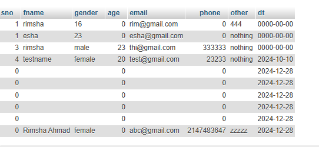

# US Travel Form Project

## Overview

This project is a simple PHP-based form that allows users to submit their information (name, age, gender, etc.) for a US trip. The data is submitted via a POST request and stored in a MySQL database. The project demonstrates PHP form handling, MySQL database interaction, error handling, success messages, and basic HTML/CSS frontend development.

---

## Key Concepts Covered:
- **PHP Form Handling:** Processing form data using POST requests.
- **MySQL Database Interaction:** Using PHP to interact with a MySQL database to insert and retrieve data.
- **SQL Injection Prevention:** Using safe query practices to protect against SQL injection.
- **Dynamic HTML with PHP:** Displaying success messages based on form submission status.
- **HTML Forms & Validation:** Structuring and validating form data using HTML attributes.
- **Frontend Styling with CSS:** Styling forms to create a better user experience.
- **JavaScript:** Adding interactivity and validation to forms.

---

## 1. Database Setup

Before proceeding with the code, ensure that you have set up a MySQL database and table to store the submitted data. Here’s the SQL to set up the database and table:

### SQL Query to Create Database and Table

```sql
-- Create the database (if not already created)
CREATE DATABASE us_trip;

-- Use the database
USE us_trip;

-- Create the table to store trip data
CREATE TABLE trip (
    id INT AUTO_INCREMENT PRIMARY KEY,
    fname VARCHAR(100),
    age INT,
    gender VARCHAR(20),
    email VARCHAR(100),
    phone VARCHAR(20),
    other TEXT,
    dt TIMESTAMP DEFAULT CURRENT_TIMESTAMP
);
```

---

## 2. PHP Code Explanation (index.php)

### 2.1 PHP Code for Form Handling and Data Insertion

```php
<?php
if (isset($_POST['name'])) {
    $insert = false;
    $submit = true;

    // Set connection variables
    $server = "localhost";
    $username = "root";
    $password = "";
    $database = "us-trip"; // Replace with your actual database name

    // Create a connection
    $conn = mysqli_connect($server, $username, $password, $database);

    // Check the connection
    if (!$conn) {
        die("Connection to this database failed due to " . mysqli_connect_error());
    }

    // Retrieve data from the POST request---collect post variables
    $name = isset($_POST['name']) ? $_POST['name'] : '';
    $gender = isset($_POST['gender']) ? $_POST['gender'] : '';
    $age = isset($_POST['age']) ? $_POST['age'] : '';
    $email = isset($_POST['email']) ? $_POST['email'] : '';
    $phone = isset($_POST['phone']) ? $_POST['phone'] : '';
    $other = isset($_POST['desc']) ? $_POST['desc'] : ''; // Changed 'other' to 'desc' as per the form field

    // SQL query to insert data into the database
    $sql = "INSERT INTO `trip` (`fname`, `age`, `gender`, `email`, `phone`, `other`, `dt`) 
            VALUES ('$name', '$age', '$gender', '$email', '$phone', '$other', current_timestamp())";

    // Execute the query
    if (mysqli_query($conn, $sql)) {
        // Flag for successful insertion
        $insert = true;
    } else {
        echo "Error: " . $sql . "<br>" . mysqli_error($conn);
    }

    // Close the connection
    mysqli_close($conn);
}
?>
```

### Explanation:
1. **Form Handling:** PHP retrieves form data submitted via POST and inserts it into the MySQL database.
2. **Database Connection:** Establishes a connection to MySQL using `mysqli_connect`.
3. **Data Insertion:** Constructs an `INSERT INTO` SQL query to insert form data into the `trip` table.
4. **Success Flag:** After successful data insertion, a success message is displayed to the user.

---

## 3. HTML Code Explanation

```html
<!DOCTYPE html>
<html lang="en">
<head>
    <meta charset="UTF-8">
    <meta name="viewport" content="width=device-width, initial-scale=1.0">
    <title>Welcome to US Travel Form</title>
    <link rel="stylesheet" href="style.css">
</head>
<body>
    <div class="container">
        
        <h1 style="text-align: center; font-size: 20px;">Welcome to the US Travel Form</h1>
        <p>Enter your details to confirm your participation and submit this form.</p>
        
        <?php
        if ($insert == true) {
            echo "<p class='submit-msg'>Thanks for submitting your form for the US trip!</p>";
        }
        ?>

        <form action="index.php" method="post">
            <input type="text" name="name" id="name" placeholder="Enter your name" required>
            <input type="text" name="age" id="age" placeholder="Enter your age" required>
            <input type="text" name="gender" id="gender" placeholder="Enter your gender" required>
            <input type="text" name="class" id="class" placeholder="Enter your class" required>
            <input type="email" name="email" id="email" placeholder="Enter your email" required>
            <input type="tel" name="phone" id="phone" placeholder="Enter your phone number" required>
            <textarea name="desc" id="desc" cols="30" rows="10" placeholder="Enter any other information here"></textarea>
            <button type="submit" class="btn">Submit</button>
            <button type="reset" class="btn">Reset</button>
        </form>
    </div>

    <script src="script.js"></script>
</body>
</html>
```

### Explanation:
- The form collects user data and posts it to `index.php` for processing.
- The success message is conditionally displayed if the form is successfully submitted and data is inserted into the database.

```

### Explanation:
- Styles for the form, buttons, and background are provided to make the UI visually appealing and easy to use.

---

## 5. Image UI

- The **UI** of the form includes a background image (`bg.jpg`) displayed at the top of the page. The image should be placed in the same directory as the HTML file or an `images` folder.
- The background image will visually enhance the page, providing a modern look to the form UI.

Example UI for the form:


---

## 6. Random Data Insertion and Viewing in phpMyAdmin

1. **Random Data:**
   - You can insert random data into the `trip` table either by filling out the form or directly through **phpMyAdmin** by running an `INSERT INTO` query.

2. **Viewing Data in phpMyAdmin:**
   - After submitting the form, you can view the data in the `trip` table by logging into **phpMyAdmin**, selecting the `us_trip` database, and navigating to the `trip` table. The submitted data will be displayed, including name, age, gender, email, and other details.


## Advanced Concepts

### 1. SQL Injection Prevention:
For a more secure version of this code, you can prevent **SQL injection** by using prepared statements with bound parameters.

Example of Prepared Statement:
```php
$stmt = $conn->prepare("INSERT INTO trip (fname, age, gender, email, phone, other, dt) VALUES (?, ?, ?, ?, ?, ?, current_timestamp())");
$stmt->bind_param("ssssss", $name, $age, $gender, $email, $phone, $other);
$stmt->execute();
```

### 2. AJAX Form Submission:
You can submit the form without refreshing the page using **AJAX** and JavaScript, improving the user experience.

